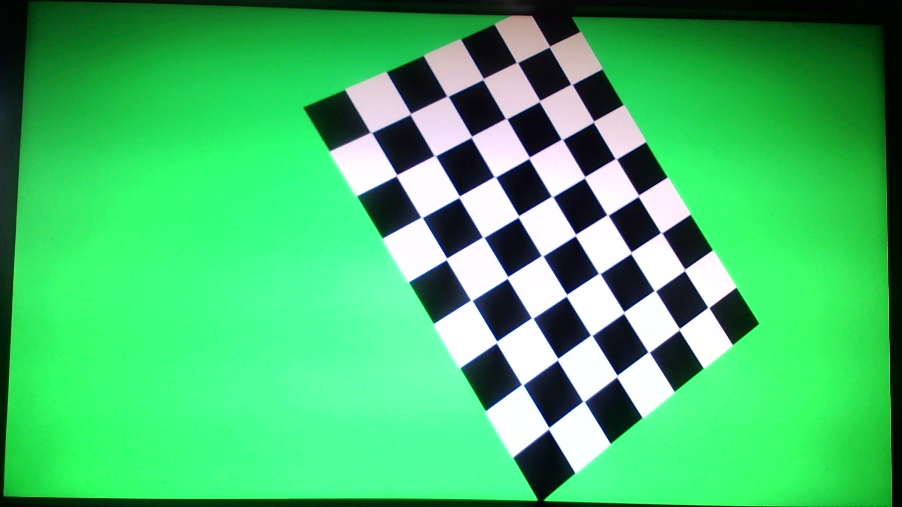
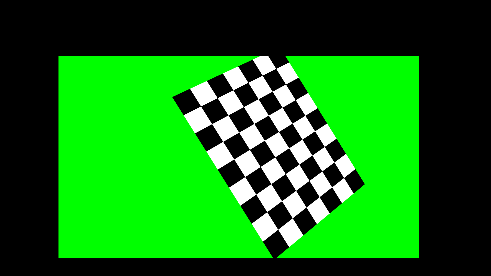
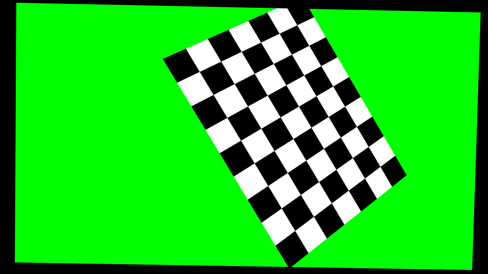

# auto-calibration
Данный проект является реализацией алгоритма для автоматической калибровки камеры, разработанного в рамках магистерской выпускной квалификационной работы по образовательной программе "Технологии разработки компьютерных игр" в университете ИТМО. Текст ВКР находится в файле [`docs/ВКР.pdf`](https://github.com/Azmalent/auto-calibration/tree/main/docs/ВКР.pdf).

Алгоритм использует изображение с экрана для симуляции перемещения калибровочного шаблона в пространстве. Камера располагается перед экраном и автоматически делает снимки. 

Алгоритм позволяет вычислить внутренние параметры камеры, а также *nodal offset*.

Для запуска проекта требуются следующие зависимости:
- [opencv-python](https://pypi.org/project/opencv-python/)
- [screeninfo](https://pypi.org/project/screeninfo/)

Для калибровки nodal offset также необходимо выполнить следующие шаги:
- Откалибровать очки VR с помощью SteamVR
- Расположить один трекер на камере и другой на верху монитора
- Получить координаты трекеров (например, с помощью [pyopenxr](https://pypi.org/project/pyopenxr/))
- Записать полученные координаты в файл `tracker_positions.txt` в формате `x y z`:
    - Координаты камеры на первой строке
    - Координаты монитора на второй строке

Координаты трекеров используются для определения позиции плоскости изображения относительно виртуальной камеры.

# Конфигурация камеры
Перед запуском программы требуется расположить камеру таким образом, чтобы выполнялись следующие условия:
1. Изображение камеры должно быть полностью покрыто изображением экрана
2. Оптическая ось должна проходить через центр экрана
3. Монитор не должен быть изогнутым

# Использование
Для запуска программы необходимо запустить файл `calibrator.py`.
Программа принимает следующие параметры командной строки:
- `-n`/`--num_captures` - количество снимков для калибровки (обязательный параметр)
- `-d`/`--distance` - расстояние от камеры до экрана в миллиметрах. Необходимо для корректной калибровки nodal offset. (обязательный параметр)
- `--mode` - режим калибровки. Принимает следующие значения:
    - `full` - калибровка внутренних параметров и затем nodal offset (по умолчанию)
    - `intrinsic` - калибровка только внутренних параметров
    - `extrinsic` - калибровка только nodal offset
- `--monitor` - ID монитора для вывода калибровочного изображения. По умолчанию `0`.

# Пример полученных снимков
## Снимок физической камеры

## Снимок виртуальной камеры

## Снимок виртуальной камеры после корректировки nodal offset

# Результаты выполнения программы
В результате своей работы программа создаёт следующие файлы в папке `output`:

## Результаты калибровки внутренних параметров
- `camera_matrix.txt` - матрица камеры
- `optimal_camera_matrix.txt` - оптимальная матрица камеры для исправления дисторсии
- `distortion.txt` - коэффициенты дисторсии
- `errors.txt` - ошибки репроекции для каждого снимка
- `mean_error.txt` - средняя ошибка репроекции
- `rmse.txt` - среднеквадратическая ошибка репроекции

## Результаты калибровки nodal offset
- `nodal_offset_translation.txt` - вектор смещения
- `nodal_offset_rotation.txt` - матрица поворота
- `nodal_offset_errors.txt` - средняя ошибка репроекции
- `nodal_offset_rmse.txt` - среднеквадратическая ошибка репроекции